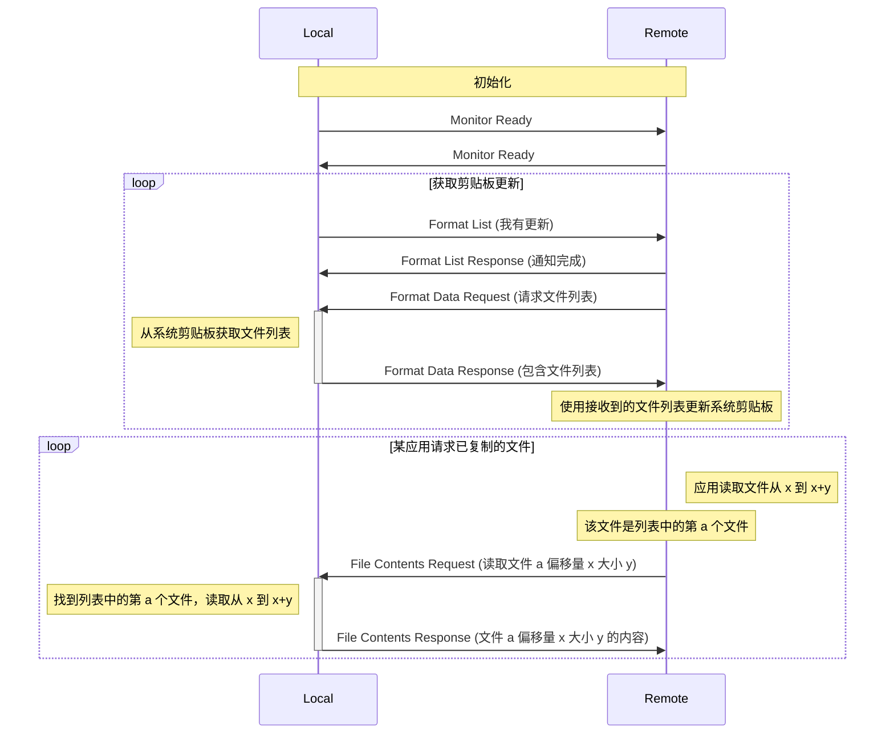
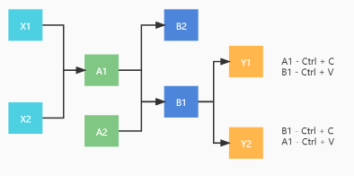
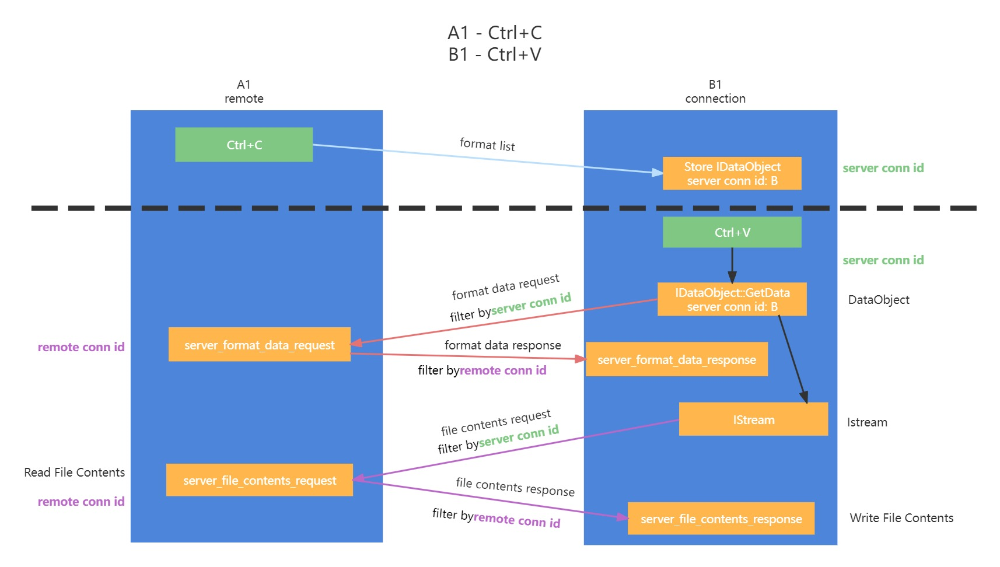
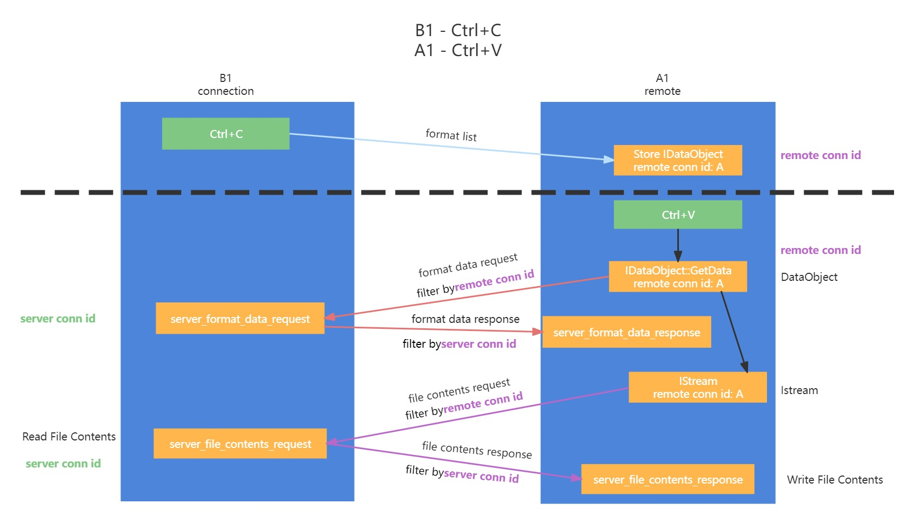

# clipboard

通过网络复制文件和文本

## 工作原理

术语:

- cliprdr: 此模块
- local: 发起文件复制事件的一端
- remote: 粘贴来自 `local` 复制的文件的一端 

文件复制和粘贴的主要算法基于
[Remote Desktop Protocol: Clipboard Virtual Channel Extension](https://winprotocoldoc.blob.core.windows.net/productionwindowsarchives/MS-RDPECLIP/%5bMS-RDPECLIP%5d.pdf),
可以总结如下:

0. local 和 remote 互相通知已准备就绪。
1. local 订阅/监听系统剪贴板的文件复制事件。
2. local 收到文件复制事件后，通知 remote。
3. remote 确认收到并尝试拉取文件列表。
4. local 更新其文件列表，remote 将接收到的文件列表刷新到剪贴板。
5. remote 的操作系统或桌面管理器发起粘贴，使其他程序读取剪贴板文件。将这些读取请求转换为 RPC 调用：
   - 在 Windows 上，所有文件读取都会通过流文件 API 进行。

6. 一个接一个地完成所有文件的粘贴.

从网络数据传输的角度来看:

注意：在实际实现中，双方都可以发送剪贴板更新并请求文件内容。并没有只允许 local 更新剪贴板并将文件复制到 remote 的限制。

## 实现

### windows

该协议最初设计为 Windows RDP 的扩展，因此消息包的格式非常适合 Windows。

启动 cliprdr 时，会创建一个线程以创建一个不可见窗口并订阅 OLE 剪贴板事件。窗口的回调（见 src/windows/wf_cliprdr.c 中的 cliprdr_proc）被设置为处理各种事件。

详细实现见上图.
